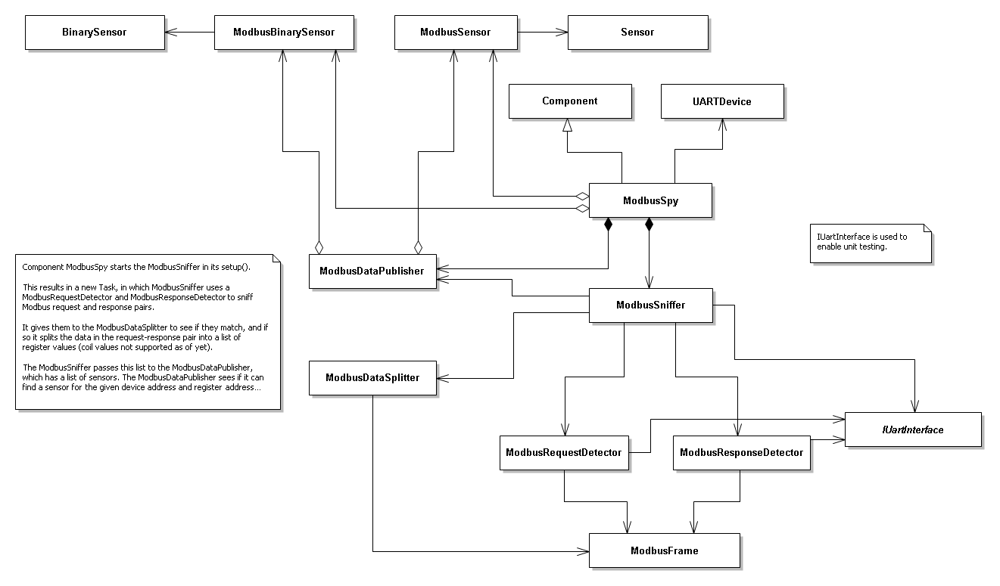

# modbus-spy-esphome

### How to find the register addresses

- Vendor documentation (if available)
- Set log level to DEBUG  
The component will log all registers it detects and supports, e.g.:  
`Finding sensor for register address 42100, to publish value 5102`
- Black magic

## Modbus

A communications protocol that is very popular in industrial environments, but also used by devices like heat pumps and ventilation systems. For more information on Modbus see [Modbus on Wikipedia](https://en.wikipedia.org/wiki/Modbus), [Modbus website](https://modbus.org) or [the Modbus specs](https://modbus.org/specs.php) on that site.

One thing to mention is that in the context of Modbus the Client is the one sending requests, and the Servers respond to it. There can be only one Client, and multiple Servers. This is confusing as most people would assume it the other way around: that the controlling device that requests data from and sends data to the various devices on the bus would be called the Server.
That is not the case!

From a data standpoint it does make sense: a controller requires data from the various devices to be able to control them. Therefore it requests data, and the devices serve up the requested data.

### Modbus - physical

The PCB contains a single RS-485 transceiver chip, only receives and does NOT transmit. 

This sw integration only supports Modbus based on RTU transmission mode. 
It assumes a 2-wire bus on which both the client and servers send and receive. 
Another possible bus topology is the 4-wire bus: this is two 2-wire buses in parallel, where one is used for client to servers communication, and another for the other way around. This is in principle not supported! All communication needs to come in on a single UART RX pin. One could of using a logic AND to combine two RX signals to a single signal, but this is a hypothetical solution to a problem I did not encounter yet. 

### Modbus - Protocol

The basics are very simple: The client sends a frame to a server, and the server replies with another frame.

Example:
1. To read out a range of registers from server X, the client sends a request on the bus that addresses server X, indicating it wants to read registers by using so-called function code 3, and indicates the range in the request.
2. Server X sends a response containing its own address and function code 3, and the requested data.

Modbus defines roughly two different types of data: single bits and 16-bit registers.
Registers can be divided in Input Registers and Holding Registers, while single bits can be divided in Discrete Inputs and Coils.

Applications can decide how to use those bits and registers: it is also possible to use a 16-bit register to store multiple 1-bit values, or combine two or more 16-bit registers to form bigger registers.

Different function codes are available to read and write these inputs, coils and registers. A few of them:

| Function code | Meaning |
| :-----------: | :------ |
| 1             | Read Coils |
| 2             | Read Discrete Inputs |
| 3             | Read Holding Registers |
| 4             | Read Input Register |
| 5             | Write Single Coil |
| 6             | Write Single Register |
| 15            | Write Multiple Coils |
| 16            | Write Multiple Registers |

In case of trouble, the server can respond with an error and exception code.

The protocol is Big Endian: multi-byte values are transferred Most Significant Byte first.
One exception is the CRC in the telegrams.

## What is supported, and what not

First of all, this information is not complete.  

### Supported Modbus function codes

At this moment only function code 3, to read holding registers, is supported.
This means that if the client reads out holding registers, this integration is able to read the requested register addresses and the values returned by the server.

#### Data types supported for function code 3

Two types of data are supported: 
- 16-bit values  
These can be configured as a sensor
- Single flag occupying an entire 16-bit register  
These can be configured as binary_sensor

### Unsupported Modbus features

Function codes other than 3 are currently not supported.

Error and exception codes are not supported explicitly. If a response can be matched to a request, the data will be parsed. If not (e.g. if a server returns an error code) the request, response or request-response pair will be discarded.

## Structure of this repository

This repository is a PlatformIO project to allow unit testing of part of the code.  
Normally a PlatformIO project can be built and it will result in a binary. This is NOT the intention of this project!  

I highly recommend the PlatformIO extension for VSCode to run unit tests.
  
Below follows the structure of this repository:

    modbus-spy-esphome
    ├── components
    │   ├── modbus_spy
    │   │   ├── __init__.py
    │   │   ├── binary_sensor.py
    │   │   ├── esp32_arduino_uart_interface.h
    │   │   ├── modbus_binary_sensor.cpp
    │   │   ├── modbus_binary_sensor.h
    │   │   ├── modbus_data_publisher.cpp
    │   │   ├── modbus_data_publisher.h
    │   │   ├── modbus_data_splitter.cpp
    │   │   ├── modbus_data_splitter.h
    │   │   ├── modbus_data.h
    │   │   ├── modbus_frame_detector_factory.cpp
    │   │   ├── modbus_frame_detector_factory.h
    │   │   ├── modbus_frame.cpp
    │   │   ├── modbus_frame.h
    │   │   ├── modbus_register_sensor.cpp
    │   │   ├── modbus_register_sensor.h
    │   │   ├── modbus_request_detector.cpp
    │   │   ├── modbus_request_detector.h
    │   │   ├── modbus_response_detector.cpp
    │   │   ├── modbus_response_detector.h
    │   │   ├── modbus_sniffer.cpp
    │   │   ├── modbus_sniffer.h
    │   │   ├── modbus_spy.cpp
    │   │   ├── modbus_spy.h
    │   │   ├── _sensor.py_
    |   │   └── uart_interface.h
    │   ├── test_includes
    │   │   ├── _stdint.h
    │   │   ├── crc.cpp
    │   │   ├── crc.h
    |   │   └── test_includes.h
    |   └── README
    ├── src
    │   └── main.cpp
    ├── test
    │   ├── test_modbus_data_publisher
    │   │   ├── fake_modbus_register_sensor.cpp
    │   │   ├── fake_modbus_register_sensor.h
    │   │   ├── test_modbus_data_publisher.cpp
    │   │   └── testable_modbus_data_publisher.h
    │   ├── test_modbus_data_splitter
    │   │   └── test_modbus_data_splitter.cpp
    │   ├── test_modbus_request_detector
    │   │   └── test_modbus_request_detector.cpp
    │   ├── test_modbus_response_detector
    │   │   └── test_modbus_response_detector.cpp
    │   ├── test_modbus_sniffer
    │   │   ├── fake_modbus_request_detector.h
    │   │   ├── fake_modbus_response_detector.h
    │   │   └── test_modbus_sniffer.cpp
    │   ├── fake_modbus_data_publisher.cpp
    │   ├── fake_modbus_data_publisher.h
    │   ├── fake_uart_interface.h
    │   └── README
    ├── .gitignore
    ├── design_heap.png
    ├── design_main.png
    ├── design_overview.png
    ├── example.yaml
    ├── ModbusSpy.ncp
    ├── more-info.md
    ├── platformio.ini
    └── README.md

The entire component resides in /components/modbus_spy  
Unit test files are in /test  
Design diagrams are in ModbusSpy.ncp, which can be opened in [NClass](https://nclass.sourceforge.net/)  
An example YAML file can be found in example.yaml

## Unit Testing - What does it look like

Using PlatformIO one can execute the unit tests, with the following results (at moment of writing this):

## Design

### Design Overview

See below diagram (taken from [design.ncp](https://github.com/pdjong/mbus-esphome/blob/main/design.ncp))

MbusController is a Component that starts a FreeRTOS task in which it reads out the meter if required, and passes the read data to its MbusSensors. Those transform the raw binary data to a sensor value and then publish this value.

MbusReader uses its DataLinkLayer to read out the meter's binary data in the form of a Long Frame telegram. It then passes this telegram to the DataBlockReader, which knows how to read the variable data blocks from the binary user data in the telegram.

MbusController needs to know what data block each sensor requires. Therefore the sensors implement an interface that provides a way for the MbusController to see if a given data block fits the sensor.

### IUartInterface

The DataLinkLayer does not directly use the UARTDevice, but uses an interface instead. This is to enable unit testing of the DataLinkLayer and MbusReader classes.

Unit test code instantiates FakeUartInterface and passes that to the code under test (MbusReader or DataLinkLayer).  
The MbusController code instantiates Esp32ArduinoUartInterface while passing itself as a UARTDevice, and passes that to the MbusReader.

That way the Esp32ArduinoUartInterface actually uses the real hardware, while the FakeUartInterface does not.

